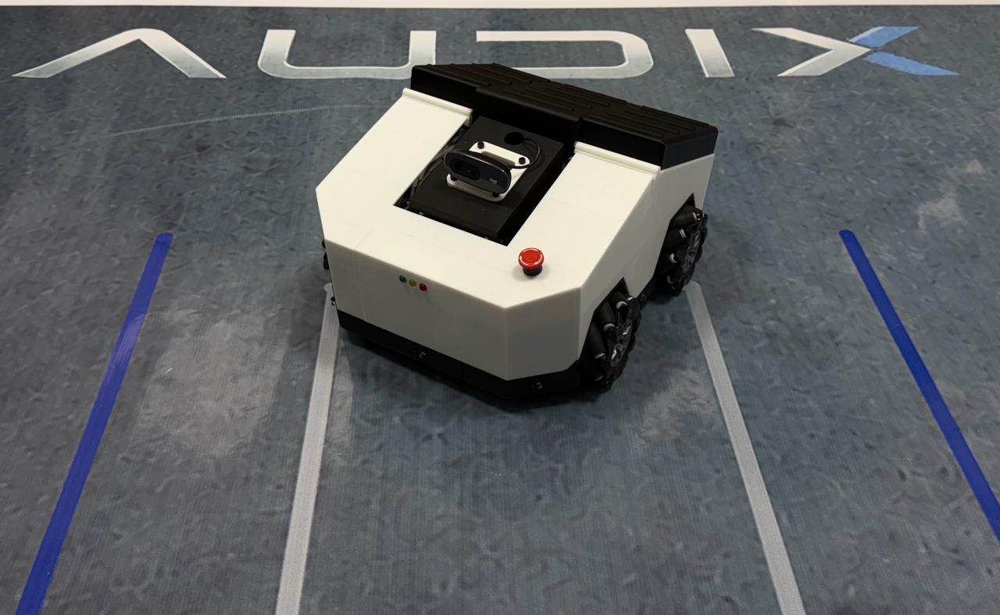
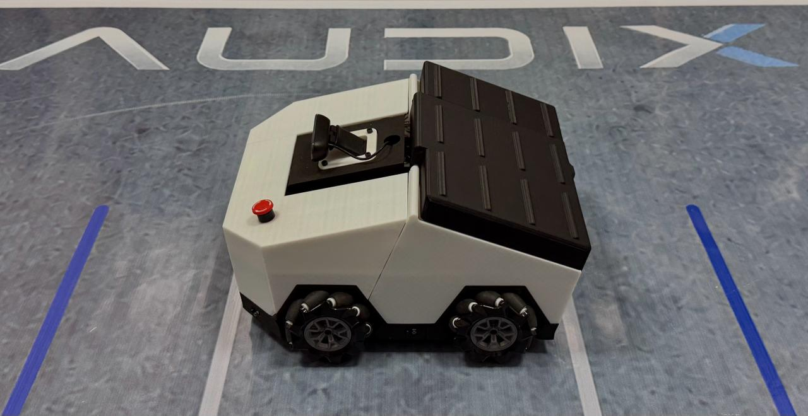
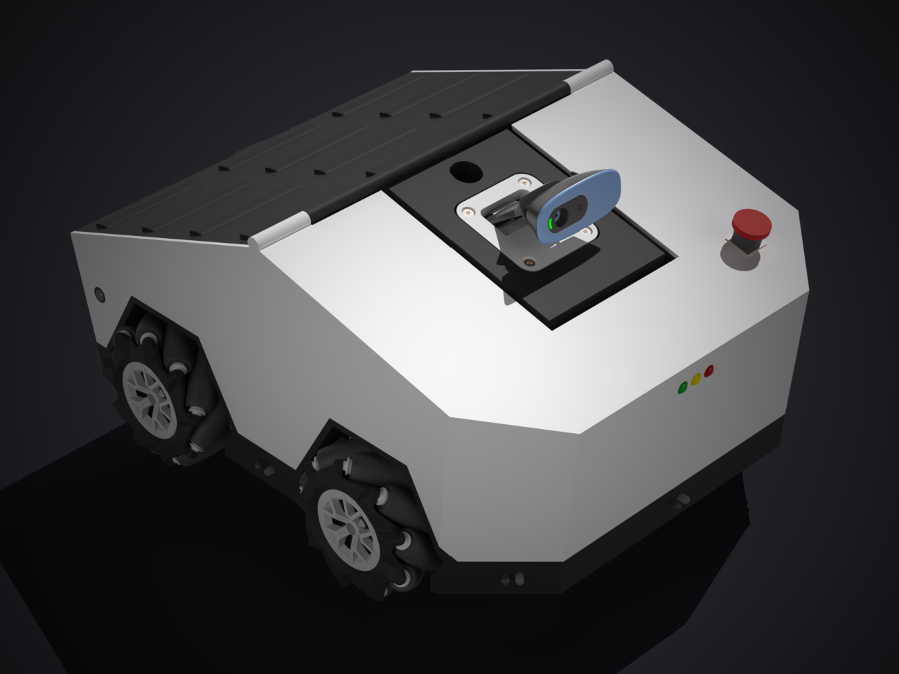
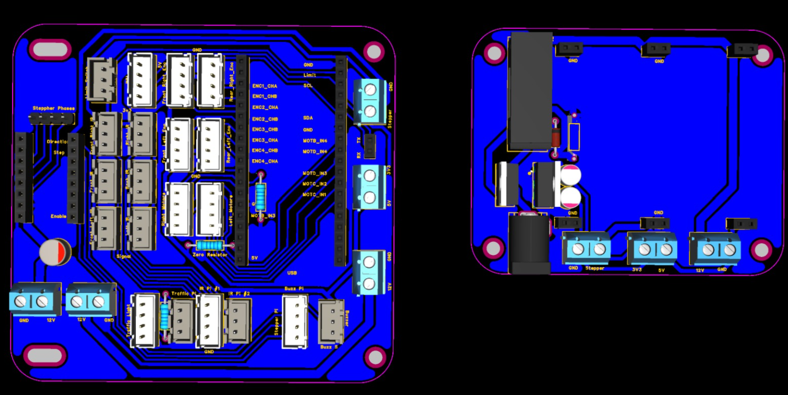

# Battery Powered Mobile Robot - Audix

Audix is a battery-powered mobile robot developed for warehouse-style auditing, navigation, sensing, and low-level motion control. This repository brings together the project software, simulation work, embedded control code, electrical design files, documentation, media, and test assets in one place.

## Project Overview

Audix combines several connected subsystems:

- ROS 2 robot software for mission control, sensing, dashboard access, and service orchestration
- Gazebo and RViz simulation assets for robot visualization and behavior testing
- ESP32 embedded control and bench firmware for mecanum motion, PID tuning, IMU feedback, and hardware validation
- electrical design resources including battery sizing, wiring, PCB files, and LTspice documentation
- project documentation, archive files, images, and simulation videos

## Key Components

- `source-repositories/ros2_ws/`
  ROS 2 runtime workspace for the robot stack, micro-ROS communication, GPIO control, vision, dashboard services, and mission flow.

- `source-repositories/Audix/`
  Simulation-focused robot package including URDF, Gazebo launch files, RViz configuration, controllers, and robot meshes.

- `source-repositories/esp32-mecanum-yaw-hold/`
  Standalone ESP32 bench firmware for mecanum yaw hold, heading correction, wheel RPM validation, and control tuning.

- `source-repositories/aduix-esp32-windows-test/`
  Windows-based ESP32 testing sandbox for isolated hardware bring-up, motor checks, IMU checks, encoder validation, and stepper testing.

## Repository Layout

- `documentation/`
  Final project report and written documentation.

- `electrical/battery-sizing/`
  Battery sizing calculations and related electrical planning files.

- `electrical/wiring-schematic/`
  Wiring schematic and Fritzing-based electrical layout files.

- `electrical/pcbs-full-files/`
  PCB project source files.

- `electrical/ltspice-simulation/`
  LTspice simulation documentation.

- `archives/`
  Project archive files and packaged design assets.

- `assets/images/`
  Robot photos, rendered visuals, and PCB screenshots.

- `assets/videos/`
  Simulation videos and recorded motion results.

## Project Images

### Physical Robot

### Design And PCB Visuals

## Main Project Files

- Final documentation: `documentation/audix-final-documentation.pdf`
- Battery sizing: `electrical/battery-sizing/battery-sizing.pdf`
- Wiring schematic: `electrical/wiring-schematic/fritzing-version-1-stepper-ir.fz`
- PCB project: `electrical/pcbs-full-files/design-2.eprj`
- LTspice simulation: `electrical/ltspice-simulation/ltspice-simulation.pdf`
- Project archive: `archives/audix-mk1.rar`

## Simulation Media

- `assets/videos/midterm-simulation-1.mp4`
- `assets/videos/midterm-simulation-2.mp4`
- `assets/videos/midterm-simulation-3.mp4`

## Notes

- Large media files such as `.rar` archives and `.mp4` videos are tracked with Git LFS.
- This repository is organized as a full project record, covering software, hardware, design, and documentation together.
